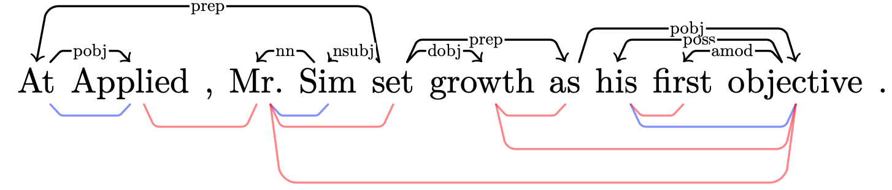

# CPMI-Dependencies

This repo contains the official code release for the EMNLP2021 paper:

[_Linguistic Dependencies and Statistical Dependence_](https://arxiv.org/abs/2104.08685).

[Jacob Louis Hoover](https://jahoo.github.io), Alessandro Sordoni, Wenyu Du, and Timothy J. O'Donnell

# Replication

## Setup

To use first create conda environment with requirements using

```bash
conda create --name cpmi_env --file cpmi_environment.yml
conda activate cpmi_env
```

Then
```bash
pip install transformers
pip install sentencepiece # install sentencepiece tokenizer for xlnet
```

or
```bash
pip install -r cpmi_pip_requirements.txt
```
<!-- 
These requirement files were made using the following:
```
conda env export --no-builds | grep -v "^prefix: " > cpmi_environment.yml
pip freeze > cpmi_pip_requirements.txt 
``` 
-->

## Examples

- `example.ipynb`: interactive example getting CPMI matrices

- CLI interface example:

    ```bash
    mkdir results
    python pmi_accuracy/txt_to_pmi.py --txt example_sentences.txt --verbose --model_spec 'xlnet-base-cased'
    ```
    Gets CPMI matrices, using XLNet, for sentences in file `example_sentences.txt`.  Outputs to `results/` dir.

## Data

Get Data:

- **WSJ** From [LDC](https://catalog.ldc.upenn.edu/LDC99T42). *Data used for the main evaluation results: the 1700 sentences of the dev split, partition 22 (in CONLL format, this should be 40117 tokens).*

  - Convert Treebank to CONNL format (supply your local location of MRG files of Penn WSJ, and stanford CoreNLP installation)
    ```
    scripts/convert_splits_to_depparse.sh $LOCAL_Treebank3/PARSED/MRG/WSJ $LOCAL_CORENLP
    ```
  - Convert CONNL to raw txt:
    ```
    scripts/convert_conllx_to_raw.sh ./ptb-wsj-data/ptb3-wsj'
    ```

- **Multilingual**: Parallel Universal Dependencies (PUD) treebanks for 20 languages, available as part of [UDv2.7](https://lindat.mff.cuni.cz/repository/xmlui/handle/11234/1-3424).
  - save data in directory `ud-treebanks/` (so that there should be a directory for each language of the form `ud-treebanks/UD_*-PUD`)


## Getting CPMI dependencies from contextual embeddings

Running [main.py](pmi_accuracy/main.py) gets PMI-based dependencies for sentences in PTB, using a specified language model to get PMI estimates, extracts a tree, calculates undirected attachment score, reports the results.

```bash
python pmi_accuracy/main.py > out
```

CLI options:

- `--n_observations`: (int, or string `all`). Set to calcuate UUAS for only the first _n_ sentences (default=`all` will do all sentences in the file specified at `conllx_file`).
- `--model_spec`: the transformers model spec string for which tokenizer, model, and pretrained weights to use: specify `xlnet-base-cased`, `xlnet-large-cased`, `bert-base-cased`, `bert-large-cased`, `bert-base-uncased`, `bert-large-uncased` or `xlm-mlm-en-2048`, or a path to pretrained model and config (see below) (default=`xlnet-base-cased`)
- `--offline_mode`: option for running on cluster node without internet access.
- `--connlx_file`: the path to a dependency file (in [CONLL-X format](https://ilk.uvt.nl/~emarsi/download/pubs/14964.pdf), such as generated by stanford CoreNLP's `trees.EnglishGrammaticalStructure`. See (convert_splits_to_depparse.sh)[scripts/convert_splits_to_depparse.sh]). (default=`ptb3-wsj-data/ptb3-wsj-test.conllx`),
- `--results_dir`: the root folder for results to be generated. A run of the script will generate a timestamped subfolder with results within this directory (default=`results/`)
- `--batch_size`: (int) size of batch dimension of input to xlnet (default 64).
- `--pad`: (int) default=0. Since these models do worse on short sentences (espeially XLNet), sentences in the PTB which are less than `pad` words long will be padded with context up until they achieve this threshold.  Predictions are still made only on the sentence in question, but running the model on longer inputs does slow the testing down somewhat, and you may need to lower `batch_size` in order to keep from running out of cuda RAM.
- `--save_matrices`: (boolean) set to save pmi matrices to disk
- `--probe_state_dict`: for the word embedding plus linear POS probe. Specify path from which to load linear probe state_dict.  With this option, POS-based CPMI is computed (a PMI estimate based on the probability of POS tag, rather than word identity, as a hypothetically more purely syntactic measure).  See below.
- `--pos_set_type`: for the word embedding plus linear POS probe, which POS tagset to use. Specify `upos` (the 17-POS tagset of Universal Dependencies) or `xpos` (the 45-POS tagset of the PTB). Default `xpos`. Ignored if not doing POS probe.

### Output

Two datasets as output:

- `scores` CSV (sentence level data),
- `wordpairs` CSV (word-pair level data within sentences).

In each of these, the column `sentence_index` refers to the number of the sentence in the input dataset.

### Reporting

The results will be reported in a timestamped folder in the `/results` dir (or other if specified) like:
```
{results_dir}/xlnet-base-cased_{n_observations}_{date}/
| info.txt
| scores{...}.csv         <--[UUAS results in one row per sentence]
| wordpairs{...}.csv      <--[UUAS results in one row per word-pair within sentences]
| (pmi_matrices.npz)
| (pseudo_logliks.npz)
```
- `spec.txt` - echo of CLI arguments, and also mean uuas scores, for reference and convenience.
- `scores.csv` - one row per sentence, reporting the sentence length, uuas with the four different ways of symmetrizing, and baseline uuas.
- `wordpairs.csv` - one row per pair of words in sentence (unordered), with various possible predictors including PMI scores.
- `pmi_matrices.npz` - (generated with the cli option `--save_npz`) an .npz archive of a collections.OrderedDict of calculated CPMI matrices as numpy arrays, with the space delimited sentence as the key.
- `pseudo_logliks.npz` - (generated with the cli option `--save_npz`) an .npz archive of a collections.OrderedDict of calculated pseudo-loglikelihoods, with the space delimited sentence as the key.

### Run on all languages from PUD data

Once PUD data are downloaded (as part of UDv2.7) to `ud-treebanks/UD_*-PUD/` directories, 
```bash
# The 20 languages that have PUD treebanks
PUD_LANGS=(Arabic Chinese Czech English Finnish French German Hindi Icelandic Indonesian Italian Japanese Korean Polish Portuguese Russian Spanish Swedish Thai Turkish)

for lang in ${PUD_LANGS[@]}; do
  python pmi_accuracy/main.py --results_dir results/PUD/${lang} --pad 30 --save_npz --model_spec bert-base-multilingual-cased --batch_size 8 --conllx_file ud-treebanks/UD_${lang}-PUD/*_pud-ud-test.conllu > PUD-${lang}.out
done
```


### Baselines

- The matched-length baseline/control is computed with [lengthmatch.py](lengthmatch.py).

- Two other simple baseline classes are defined in [task.py](pmi_accuracy/task.py).

  - `LinearBaselineTask`: makes a matrix whose entries are simply word-to-word distance in the string.  Recovering an min spanning tree from this matrix will give what turns out to be a relatively strong baseline.

  - `RandomBaselineTask`: just makes a random matrix for the observation.  We can use this for projective and nonprojective random baselines (using the projective and nonprojective parsers in [parser.py](pmi_accuracy/parser.py)).

- Word2Vec baseline computed using gensim's w2v, not included in this repo.


### Plotting dependencies in Ti*k*Z

[print_tikz.py](pmi_accuracy/print_tikz.py) prints dependency trees with TikZ for visualization.

Plotting pmi dependencies vs gold is useful... maybe.  To look at some plots, use [print_tikz.py](pmi_accuracy/print_tikz.py).  For instance, to look at sentences 1696, run:

```bash
python pmi_accuracy/print_tikz.py --sentence_indices 1696 --input_file path/to/scores*.csv
```

This will output a LaTeX file `dependencies.tex` into the results directory where the scores are.

Example:



- `--edge_type` you can specify projective or non projective edges, or symmetrize method tril, triu, sum, none like: `--edge_type nonproj.edges.tril`, for instance.  Default is `projective.edges.sum`.
- optionally, specify multiple sentence indices to plot multiple sentences at a time, and/or specify multiple edge types likewise.
- see `-h` for more

### Saving CPMI matrices

With the cli option `--save_npz`, PMI matrices are saved to a file 'pmi_matrices.npz' in the results dir.  These can be read back in afterward like this:

```python
npzfile = np.load(RESULTS_DIR + 'pmi_matrices.npz')
print(npzfile.files)
matrix_0 = npzfile[npzfile.files[0]]
```

### Loading saved CPMI matrices and scoring from them

Load saved matrices by specifying  `--model_spec load_npz` instead of a language model. Specify the directory containing `pmi_matrices.npz` and `pseudo_logliks.npz` with `--model_path`. This will create a new results directory with the calculated scores.  

Example: after saving matrices and (pseudo log-liklihoods) to disk in directory `results/bert-base-cased_pad10`, by running

```bash
python pmi_accuracy/main.py --model_spec bert-base-cased --save_matrices --pad 10
```

you can score these again (with different cli options, such as adding `--absolute_value`, say), with

```bash
python pmi_accuracy/main.py --model_spec load_npz --model_path results/bert-base-cased_pad10 --absolute_value
```

## POS-CPMI

### simple POS-CMPI

[linear-probe.py](pmi_accuracy/linear-probe.py) trains a single-layer linear network to extract POS embeddings from pretrained contextual embeddings, using the Penn Treebank (training split being partitions 02-21).

Running `pos_probe.py` saves trained probe's state_dict to a directory `probe-results/{model_spec}-{date}/` with an info.txt file.  

```bash
python pmi_accuracy/pos_probe.py
```

- `--model_spec`: optional, specify transformers model (e.g. "xlnet-base-cased", "bert-large-cased"), or path for offline (default `bert-base-cased`).
- `--pos_set_type`: optional, specify `xpos` (PTB's 45 tags) or `upos` (UD's 17 tags) (default='xpos').
- `--batch_size`, optional, default `32`
- `--epochs`, optional, default `40`
- `bottleneck`, set to use bottleneck probe
- `--optimizer`, default='adam' ('adam' or 'sgd')
- `--lr`, default=0.001
- `--weight_decay`, default=0.0001
- `--momentum`, default=0 (for optimizer='sgd')
- `--epochs`, default=40

### IB POS-CPMI

We implement the information bottleneck technique roughly following (Li and Eisner 2019)[https://www.aclweb.org/anthology/D19-1276.pdf], replacing the linear probe in "simple POS-CPMI" above. Use `pos_probe.py` with the `--bottleneck` option to train the IB POS probe.

```bash
python pmi_accuracy/pos_probe.py --bottleneck --beta 1e-5 --optimizer adam --lr 0.001 --weight_decay 0.0001
```

### After training probe, get a POS-CPMI score

To evaluate a pretrained contextual embedding model with a newly pretrained probe on top, use the `--probe_state_dict` CLI option for `main.py`. For example, to get POS-based CPMI scores using a probe with weights saved in `path/to/probe.state_dict`, on top of `bert-base-cased` (_being careful to use model_spec that the probe was trained on_):

```bash
python pmi_accuracy/main.py --model_spec bert-base-cased --probe_state_dict path/to/probe.state_dict
```

## LSTM vs ONLSTM

These models are not included in this repo.

- `lstm_matrices.ipynb` converts logp matrices from LSTM models CPMI matrices aligned with the PTB data (so, rows and columns of NaNs where missing PMI values)
  - these are saved in `lstm-vs-onlstm/lstm` and `lstm-vs-onlstm/onlstm`

To evaluate CPMI-dependency accuracy from these models, run main.py with `--model_spec load_npz` to score, as usual.

```bash
python pmi_accuracy/main.py --model_spec load_npz --model_path lstm-results/lstm --absolute_value > lstm.out
```

# Cite

```bibtex
@inproceedings{hoover-etal-2021-linguistic,
    title = "Linguistic Dependencies and Statistical Dependence",
    author = "Hoover, Jacob Louis  and
      Du, Wenyu  and
      Sordoni, Alessandro  and
      O{'}Donnell, Timothy J.",
    booktitle = "Proceedings of the 2021 Conference on Empirical Methods in Natural Language Processing",
    month = nov,
    year = "2021",
    address = "Online and Punta Cana, Dominican Republic",
    publisher = "Association for Computational Linguistics",
    doi = "10.18653/v1/2021.emnlp-main.234",
    url = "https://aclanthology.org/2021.emnlp-main.234",
    pages = "2941--2963"
}
```

